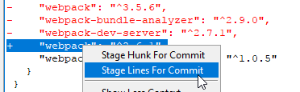

repro for vs code issues https://github.com/Microsoft/vscode/issues/34231 and https://github.com/Microsoft/vscode/issues/34360

Goal is to

This repo has a total 2 commits and just 1 file: package.json

1st commit: I added webpack

```json
{
  "webpack": "^2.6.1",
}
```

2nd commit: I updated webpack version and added 2 more deps

```json
{
  "webpack": "^3.5.6",
  "webpack-bundle-analyzer": "^2.9.0",
  "webpack-dev-server": "^2.7.1",
 }
```


But now I want to downgrade webpack to the version in the 1st commit.

So do

```
git checkout HEAD~1 -- package.json
```

Now you'll have

```json
{
  "webpack": "^2.6.1",
}
```

The webpack has been successfully downgraded but oops, you've lost the 2 deps that you added in the 2nd commit.

So now you only need to stage the 1 change related to webpack (addition/replace) and not the 2 deletions.

You can do this in Git GUI by doing this:



How to do this in VSCode?


